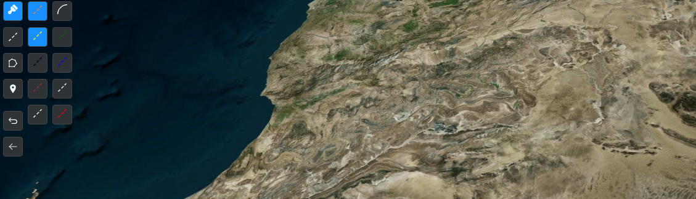

prod: https://cesium-6466f.web.app/
# CesiumJS için x-toolbox çizim aracının Dokümantasyonu ve başka bir projeye taşıma işlemi

## CesiumJS nedir?
WebGL kullanarak coğrafi doğruluk ile dinamik verileri tarayıcıda görselleştirmek için oluşturulmuş bir kitaplıkıtr. Eklentilere ihtiyaç duymadan 3D küreler(Dünya vb.) ve 2D haritalar oluşturabilir.

# x-toolbox nedir?

toolbox lat lon ve height bilgileri ile 3D küreler üzerine çizim yapmayı amaçlayan bir araçtır. Performans kaygısı göz önünde bulundurularak geliştirilmiştir. Geliştiriminde,
1. dependencies
   1.  React: Bildirimsel ve bileşen tabanlı bir front-end framework'ü
   2. **Redux-toolkit**: Redux geliştiricileri tarafından geliştirilmiş, modern redux olarak adlandırılan hook'lar ile daha hızlı state yönetimi sağayan bir kütüphane
   3.  **cesiumJS/ResiumJS**: cesiumJS'i react'ın component mimarisine uygun kullanımını sağlayan bir kütüphane.
2. devDependencies
   1.  **Typescript**: Javascript'e type güvenliği sağlayan bir javascript kapsayıcısı
   2.  Alan ve ağırlık merkezi hesaplama için 100kb boyutunda **truf.js** paketleri
   3.  Code linting için **Eslint, prettier**
kullanılmıştır. 
 

# x-toolbox nasıl çalışır?
Bu aşamaya başlamadan önce toolbox'ın bulunduğu projenin mimarisi ve dosya yapısını anlamamız gerekir.

## Proje yapısı
 x-toolbox staj süresinde geliştirdiğim ana cesium projesinde bulunamktadır. ve github projelerimden erişilebilir. Bu proje daha sonra parçalara ayrılmak üzere(toolbox, terrain provider gibi parçalar) her şey ayrı paketlerde tutulmaya çalışılmıştır
 📦src
  ┣ 📂components
  ┃ ┣ 📂Common
  ┃ ┣ 📂Globe
  ┃ ┣ 📂Menu
  ┃ ┗ 📂Toolbox
  ┣ 📂container
  ┃ ┣ 📂Menu
  ┃ ┗ 📂Toolbox
  ┣ 📂data
  ┣ 📂enum
  ┣ 📂helpers
  ┃ ┣ 📂Math
  ┣ 📂hooks
  ┣ 📂interfaces
  ┃ ┣ 📂common
  ┃ ┣ 📂globe
  ┃ ┣ 📂menu
  ┃ ┗ 📂Toolbox
  ┣ 📂modules
  ┃ ┣ 📂Globe
  ┃ ┣ 📂Sample
  ┃ ┗ 📂Toolbox
  ┣ 📂store
  ┃ ┣ 📂slice
Yukarıdaki ağaçta görüldüğü üzere proje 9 temel klasörden oluşmaktadır. Bunlar,
1. Components: Yeniden kullanılan bileşenlerin bulunduğu klasördür. Burada oluşturulan bileşenlerin hiçbir data ile bağlantısı yoktur. gerektiğinde ilgili data props ile modules'den verilir. Bu durum farklı datalar ile birden fazla component oluşturma imkanı tanır bize. Güzel bir fikir vermesi açısından: https://www.componentdriven.org/
2. container: kapsayıcıdır. React'ta bilşen mapping işlemleri genelde burada yapılır. Store ile doğrudan bağlantılıdır. Components lerin aksine tekrar kullanılma amacı güdül-meden tasarlanırlar
3. data Titleset vb genel dataların bulunduğu katmandır. Eğer eldeki data genel bir data değilse her modülün içinde store/state.ts altında saklanır.
4. Enum Projede genel sabitleri içerir. Eğer eldeki enum genel bir enum değilse her modülün içinde store/state.ts yada store/enum.ts altında saklanır.
5. Helpers çeşitli yardımcı fonksiyonları içerir bu klasör projede hesaplama yada dönüştürme fonksiyonları için sıklıkla kullanılmaktadır
6. hooks yazılan custom hookların bulunduğu klasördür
7. interfaces bu klasör interface tanımlarını içerir. Eğer eldeki interface genel bir interface değilse her modülün içinde store/type.ts altında saklanır.
8. Bileşenlerin redux ile buluştuğu noktadr. Burada bileşenler state ile birleşir.
     📂DrawingTools
     ┃ ┣ 📂store
     ┃ ┃ ┣ 📜drawingToolsSlice.ts
     ┃ ┃ ┗ 📜state.ts
     ┃ ┃ ┗ 📜type.ts
     ┃ ┃ ┗ 📜enum.ts
     ┃ ┗ 📜Index.tsx
     yukaıdaki yapıda bir modülün nasıl gözükebileceği gösterilmeye çalışılmıştır. Her modül bir Index.tsx ve store klasörlerinden oluşur. Store klaörü state enum type vb. içindir 
9.  store combine reducer'ı içeren bölümdür
## Biraz daha ayrıntı
  ┣ 📂components
  ┃ ┣ 📂Common
  ┃ ┣ 📂Globe
  ┃ ┣ 📂Menu
  ┃ ┗ 📂Toolbox
 yukarıdaki ağaçtaki gibi çoğu klasörün altında Globe, common, menu ve toolbox klasörleri vardır. 
- common klasörünün altında  ikonlar vb.
- Globe(küre) genellikle resium bileşenleri(doğrudan globe üzerinde değişiklik yapabilecek componentler)
- menu altında menü bileşenlri(goTo ve image provider)
- Toolbox altında ise bizim toolbox bileşenlerimiz vardır.

> Projenin genel yapısı incelenirken unutulmaması gereken nokta mesela drawLine(çizgi çizme) aracı toolbox altında blunsada Globe altında bulunan viewer'dan alınan mause'un lat,lon, değerlerine bağlıdır.

## Tool-box'in klasörlerinin yapısını ayrıntılı olarak inceleme
 📦src
  ┣ 📂components
  ┃ ┗ 📂Toolbox
  ┃ ┃ ┣ 📂Button
  ┃ ┃ ┃ ┗ 📂ColorMenuButton
  ┃ ┃ ┃ ┃ ┗ 📜Index.tsx
  ┃ ┃ ┗ 📂Popup
  ┃ ┃ ┃ ┗ 📜Index.tsx
Components -> toolbox -> button altında toolbox'ın butonları bulunur
Components -> toolbox -> popup altında toolbox'ın popup'ları bulunur
> popup bir dalgınlık olarak ant design ile yazılmıştır. Eğer kullanılacaksa ve projede ant design bağımlılığı yoksa ufak bir düzenleme gerekebilir.

  ┣ 📂container
  ┃ ┗ 📂Toolbox
  ┃ ┃ ┣ 📂store
  ┃ ┃ ┃ ┣ 📜state.ts
  ┃ ┃ ┃ ┗ 📜toolBoxSlice.ts
  ┃ ┃ ┣ 📜Index.tsx
  ┃ ┃ ┣ 📜style.css
  ┃ ┃ ┣ 📜style.css.map
  ┃ ┃ ┗ 📜style.sass
Container -> toolbox -> altında toolbox' ın menüsü bulunur. Projenin yapısına göre hem sass hemde css kullanılabilir. Kullanılmayan sass/css den biri silinebilir.

  ┣ 📂interface
  ┃ ┗ 📂Toolbox
  ┃ ┃ ┗ 📜Toolbox.ts
interface -> toolbox interface leri içerir

  ┣ 📂modules
  ┃ ┗ 📂Toolbox
  ┃ ┃ ┣ 📂DrawingTools
  ┃ ┃ ┃ ┣ 📂store
  ┃ ┃ ┃ ┃ ┣ 📜drawingToolsSlice.ts
  ┃ ┃ ┃ ┃ ┗ 📜state.ts
  ┃ ┃ ┃ ┣ 📂TakeBackDrawing
  ┃ ┃ ┃ ┃ ┣ 📂store
  ┃ ┃ ┃ ┃ ┃ ┣ 📜state.ts
  ┃ ┃ ┃ ┃ ┃ ┗ 📜takeBackDrawingSlice.ts
  ┃ ┃ ┃ ┃ ┗ 📜Index.tsx
  ┃ ┃ ┃ ┗ 📜Index.tsx
  ┃ ┃ ┣ 📂Line
  ┃ ┃ ┃ ┗ 📜Index.tsx
  ┃ ┃ ┣ 📂Polygon
  ┃ ┃ ┃ ┗ 📜Indx.tsx
  ┃ ┃ ┣ 📂StyleTools
  ┃ ┃ ┃ ┣ 📂store
  ┃ ┃ ┃ ┃ ┣ 📜drawingToolsSlice.ts
  ┃ ┃ ┃ ┃ ┗ 📜state.ts
  ┃ ┃ ┃ ┗ 📜Index.tsx
  ┃ ┃ ┣ 📂TakeBackCordinate
  ┃ ┃ ┃ ┗ 📜Index.tsx
  ┃ ┃ ┗ 📂Text
  ┃ ┃ ┃ ┗ 📜Index.tsx
 
- Drawing tools çizim araçları modülü
- takebackdrawing çizimi geri al
- takebackcoordinate kordinatı geri al
- line çizgi çiz
- polygon çokgen çiz
- styletools
- sitillendirme aracı
- Text tıklanan noktanın kordinatını dön :( isimlendirme hatası :( 

## Toolbox dışından alınması ve erişilmesi gerekenler

  ┣ 📂modules
  ┃ ┣ 📂Globe
  ┃ ┃ ┣ 📂Draw
  ┃ ┃ ┃ ┣ 📂store
  ┃ ┃ ┃ ┃ ┣ 📜DrawSlice.ts
  ┃ ┃ ┃ ┃ ┗ 📜state.ts
  ┃ ┃ ┃ ┗ 📜Index.tsx
  ┃ ┃ ┗ 📂PrintDistance
  ┃ ┃ ┃ ┗ 📜Index.tsx
  ┃ ┃ ┣ 📂Map
  ┃ ┃ ┃ ┣ 📜ClickForDraw.ts
  ┃ ┃ ┃ ┗ 📜Index.tsx
Draw çizimlerin haritaya eklendiği modül
print distance mesafenin haritaya eklendiği modül
map mouse kordinatlarının hesaplandığı modül

## Kullsnılan Genel yardımcılar

  ┣ 📂helpers
  ┃ ┣ 📂Math
  ┃ ┃ ┣ 📜calculateMidPoint.ts
  ┃ ┃ ┗ 📜haversine.ts
  ┃ ┗ 📜getMousePointPosition.ts
 çizginin uzunluğunu al
 iki kordinatın arasındaki metre 
 mouse pozisyonlarını hesapla
 
 [terrain docs](https://github.com/msasen/resium-project/blob/main/terrain.md)

Perfprmans önerileri
import { Color, DistanceDisplayCondition } from "cesium";
Color.RED Redux' da saklandığında serialize problemi yaşanıyor bunun yerine   color: { red: 1, green: 1, blue: 0, alpha: 1 }, kullanılmalıdır.

